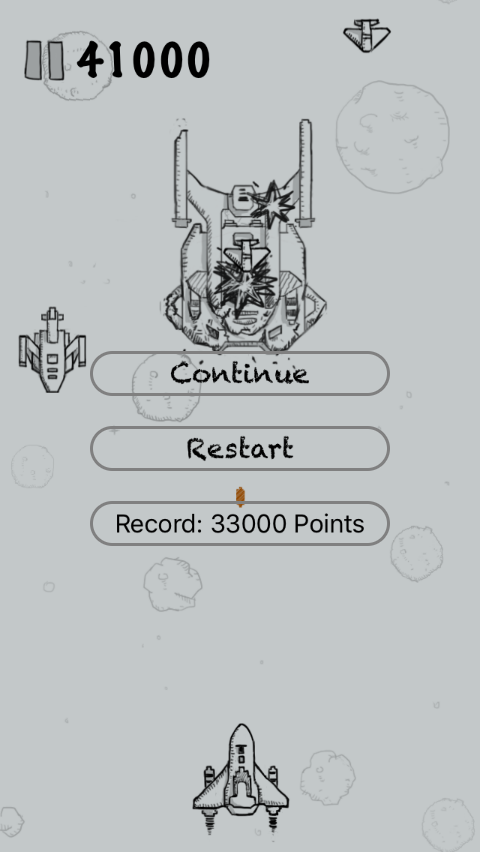
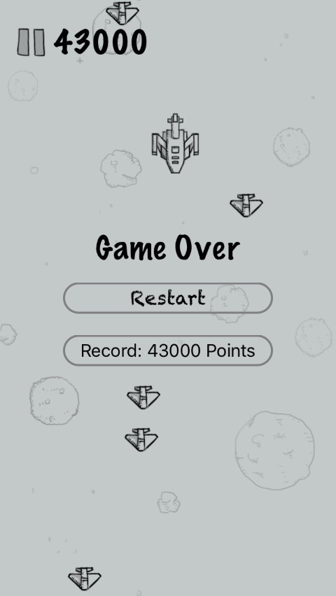
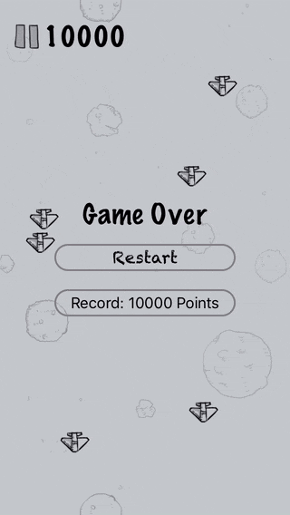

## iOS SpriteKit: Air Strike

> A mimic version of the air plane strike game from Tencent WeChat

 &nbsp; &nbsp; &nbsp;
 &nbsp; &nbsp; &nbsp;

---

### TO-DOs List
 - Enhance view across bigger screen resolutions (iPhone 6 & iPad) with self.frame & self.bounds
 - Refactor codes for object creations. (e.g, buttons)
 - Enhance Air Plane movement with relative distance and time
 - Fix runtime error warning caused by AVAudioPlayer? (Background Music)
