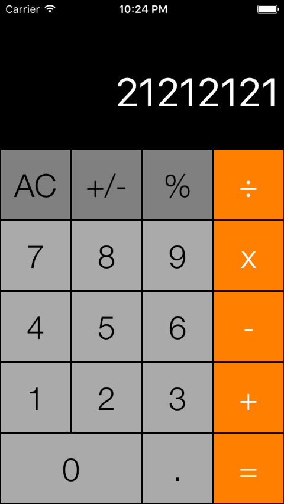
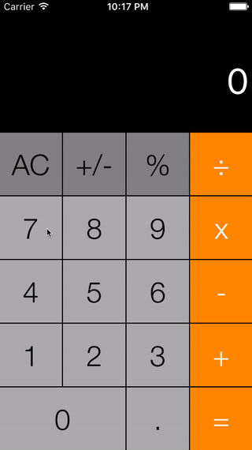

## iOS TabbedView Demo

> Implementation of a basic iOS Calculator App with clear logic and unit test.

 &nbsp; &nbsp; &nbsp;
 &nbsp; &nbsp; &nbsp;

### Goals / API Used: 
- Write clear code and sort logic using tree backtracking approach.
- Practice testing on Xcode with [XCTest](https://developer.apple.com/library/tvos/documentation/DeveloperTools/Conceptual/testing_with_xcode/chapters/01-introduction.html#//apple_ref/doc/uid/TP40014132-CH1-SW1)
 
---

### To-Dos List:
- [NSDecimalNumber](https://developer.apple.com/library/mac/documentation/Cocoa/Reference/Foundation/Classes/NSDecimalNumber_Class/): Currently does not support modulo operation, make an extension for it.
- Create more test cases for robustness and enable [Code Coverage](https://developer.apple.com/library/tvos/documentation/DeveloperTools/Conceptual/testing_with_xcode/chapters/07-code_coverage.html#//apple_ref/doc/uid/TP40014132-CH15-SW1).

