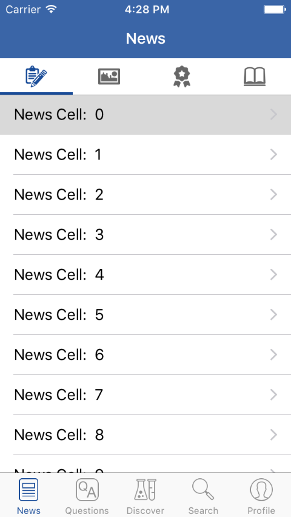
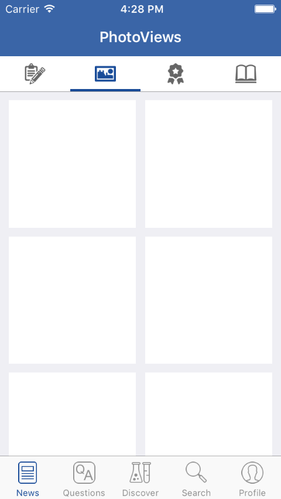
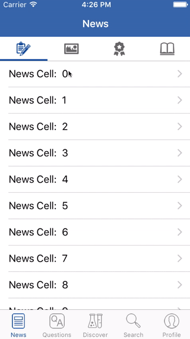

## iOS UISearchController

> Implemented a News-like client with TabbedView and CarbonKit.

 &nbsp; &nbsp; &nbsp;
 &nbsp; &nbsp; &nbsp;

### Goals / API Used 
 - [CarbonKit](https://github.com/ermalkaleci/CarbonKit): It's simply awesome.
 - [UITabBarController](https://developer.apple.com/library/ios/documentation/UIKit/Reference/UITabBarController_Class/)
 - [UICollectionView](https://developer.apple.com/library/ios/documentation/UIKit/Reference/UICollectionView_class/)

---
