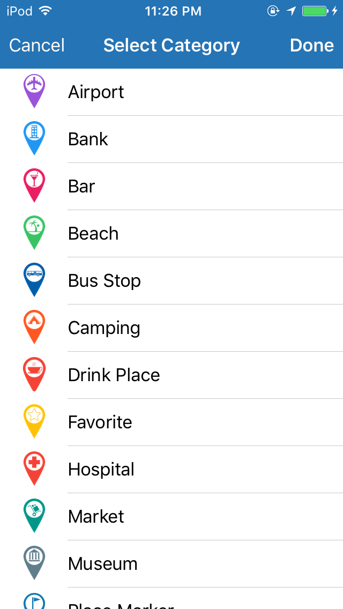
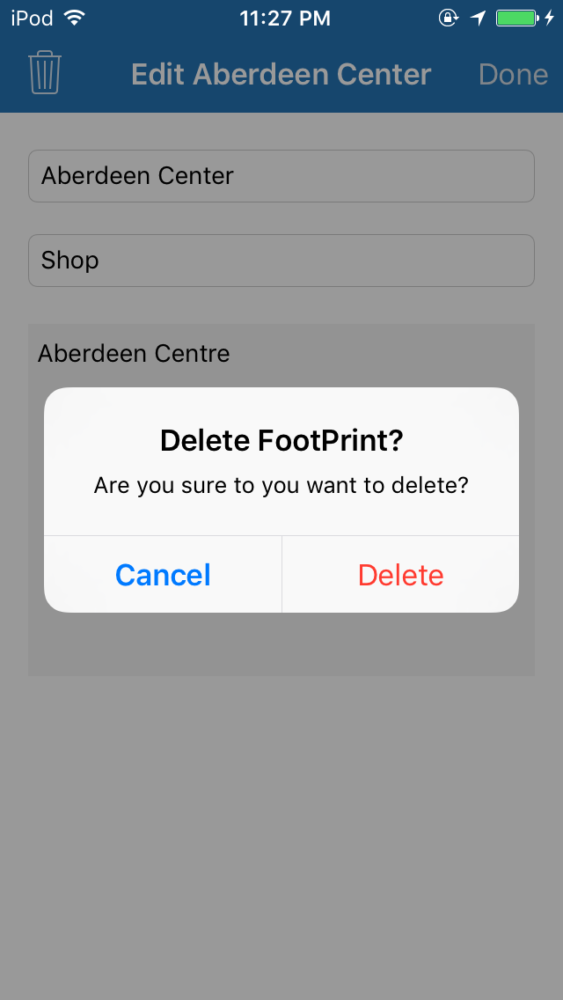

## iOS MapKit: FootPrint

> FootPrint keeps track of the places that you have visited and marked, categorizes and presents them for future reference in a neat fashion.

 &nbsp; &nbsp; &nbsp;
    
 &nbsp; &nbsp; &nbsp;
    
 &nbsp; &nbsp; &nbsp;
    
 &nbsp; &nbsp; &nbsp;
    
 &nbsp; &nbsp; &nbsp;
    

---

### Goals / API Used 
 - [Realm](https://realm.io/): Persistent Database API.
 - [CLLocation](https://developer.apple.com/library/ios/documentation/CoreLocation/Reference/CLLocation_Class/): Request userlocation through [CLLocationManager](https://developer.apple.com/library/ios/documentation/CoreLocation/Reference/CLLocationManager_Class/)
 - [MapKit Framework](https://developer.apple.com/library/ios/documentation/MapKit/Reference/MapKit_Framework_Reference/): Display and Pin FootPrints.
 - [Search Controller](https://developer.apple.com/library/ios/documentation/UIKit/Reference/UISearchController/): Search FootPrints through a search bar.
 - Others: [NavigationController](https://developer.apple.com/library/ios/documentation/UIKit/Reference/UINavigationController_Class/), [Unwind Segue](https://developer.apple.com/library/ios/technotes/tn2298/_index.html), [NSPredicate](https://developer.apple.com/library/mac/documentation/Cocoa/Reference/Foundation/Classes/NSPredicate_Class/)

---

### TO-DOs List

 - Add Distance calculation to footprint from the current location.
 - Add nevigation from current location to a given FootPrint through MapKit: MapItem.
 - Long press gesture support and recognition for dropping a new FootPrint pin.