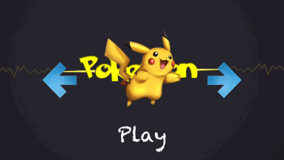
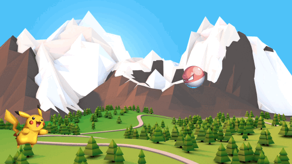
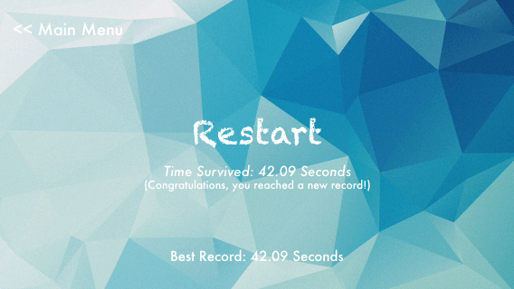

## iOS SpriteKit: Brick Breaker

<b> <-- Game Start --> </b>  
    
<b> <-- Game Play --> </b>  
    
<b> <-- Game End --> </b>  
 

---
### TO-DO List

- Add more pokemons
- Create more effects to pokemon and pockets (e.g. jumping, particle emitter)
