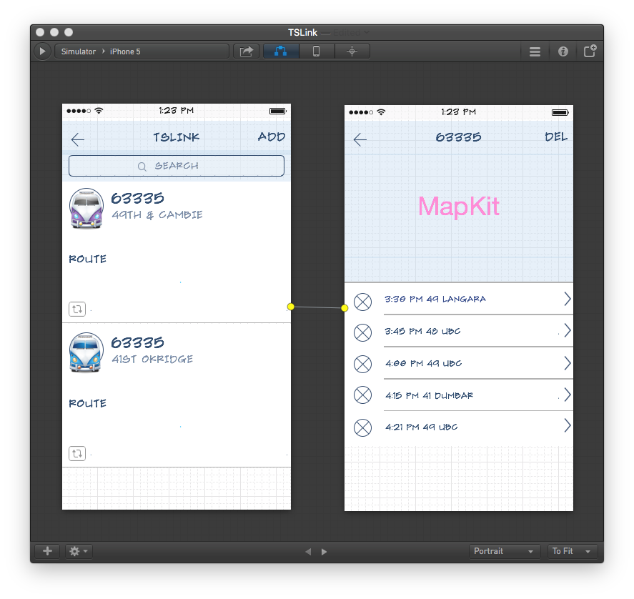

## iOS TSLink Mobile
> Implemented a mobile client for TSLink.

 &nbsp; &nbsp; &nbsp;
 &nbsp; &nbsp; &nbsp;

### Goals / API Used: 
- [Alamofire](https://github.com/Alamofire/Alamofire): Elegant HTTP Networking in Swift
- CoreData: Pure CoreData without MagicalRecord wrapper
- [Translink Open API](https://developer.translink.ca)
- Drag down update.
 
---
### To-Dos List
