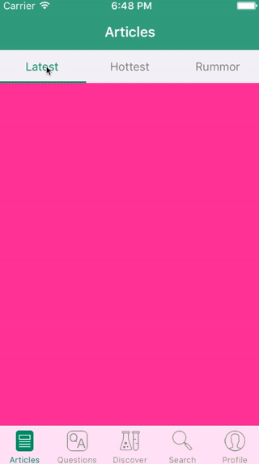
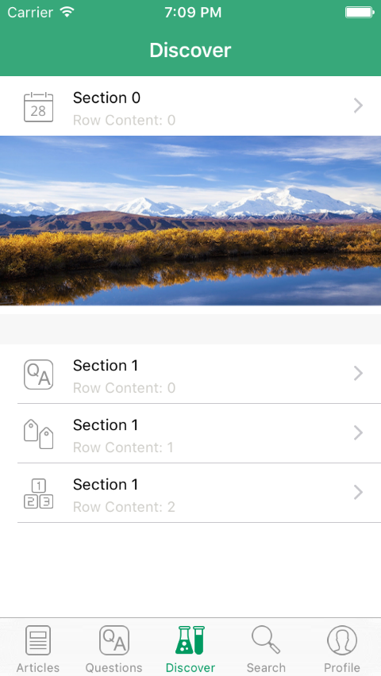
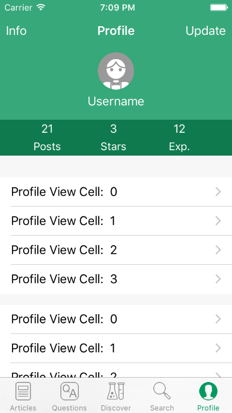

## iOS TabbedView Demo

> Implemented a News-like client with pure TabbedView coding without storyboard.

 &nbsp; &nbsp; &nbsp;
 &nbsp; &nbsp; &nbsp;

### Goals / API Used: 
- Creating UIViewController, UITableViewController, UITabController without using storyboard.
- UIScrollView API setup in ProfileController.
- Practice using xib file to load UITableViewCell and Header/Footer of a tableView
 
---

### To-Dos List:
- Practice using UIPageControl

