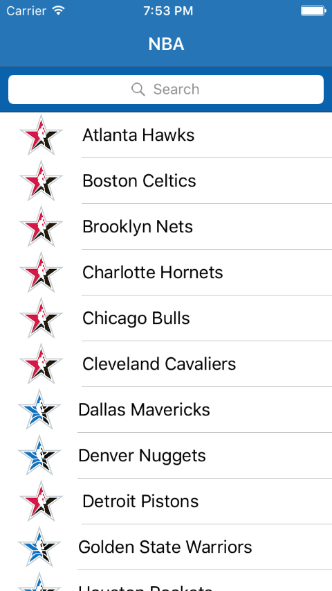
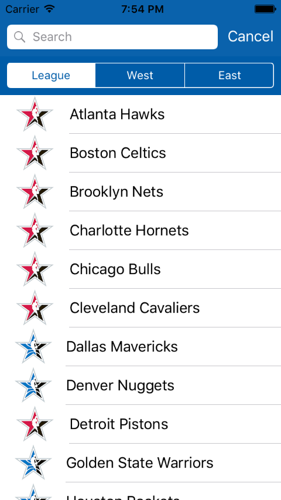
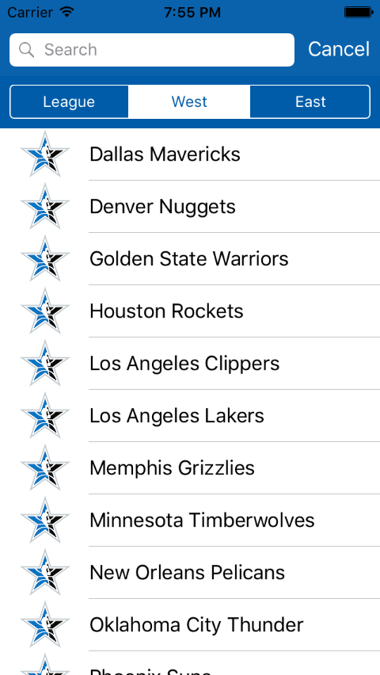
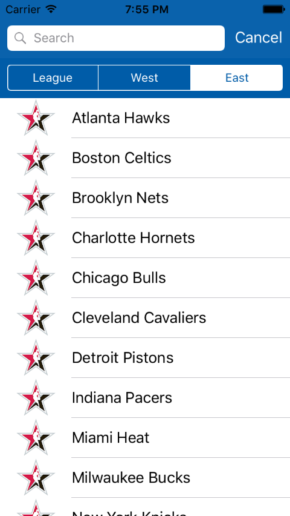
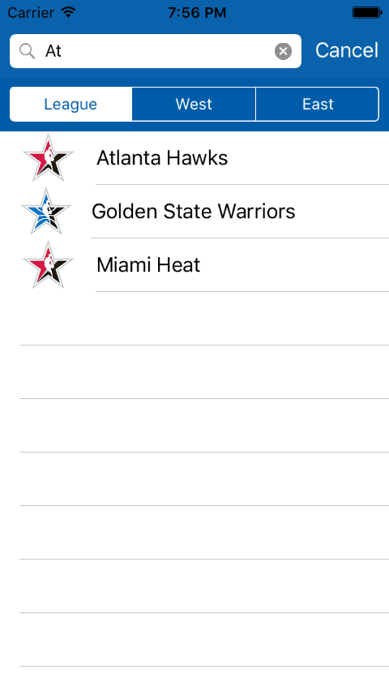
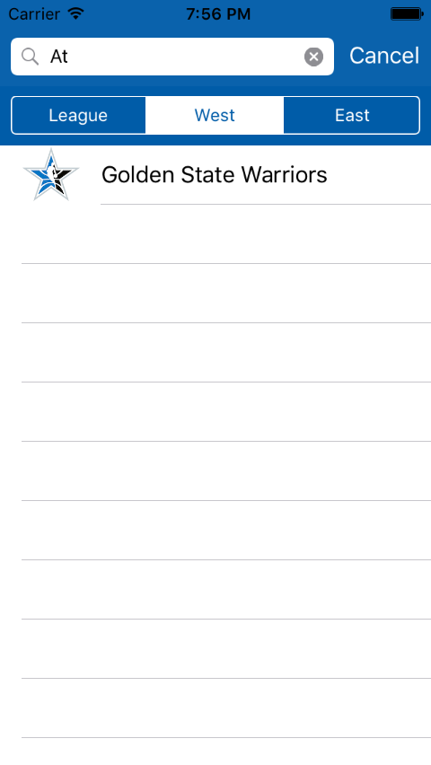
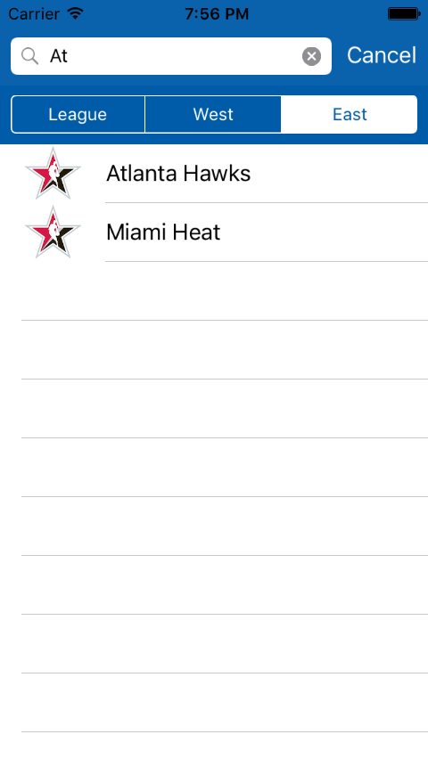

## iOS UISearchController

> Implemented UISearchController to enable filtering data according to a given search text.

 &nbsp; &nbsp; &nbsp;
 &nbsp; &nbsp; &nbsp;

 &nbsp; &nbsp; &nbsp;
 &nbsp; &nbsp; &nbsp;

 &nbsp; &nbsp; &nbsp;
 &nbsp; &nbsp; &nbsp;
 

### Goals / API Used 
 - [UISearchController](https://developer.apple.com/library/ios/documentation/UIKit/Reference/UISearchController/): Enable filtering and searching data on a tableView

---

### TO-DOs List
 - Use a secondary tableView to display the searchResults: let searchController = UISearchController(searchResultsController: someController)
 - Actions could be taken when searchController.searchBar.text == "" or != ""
